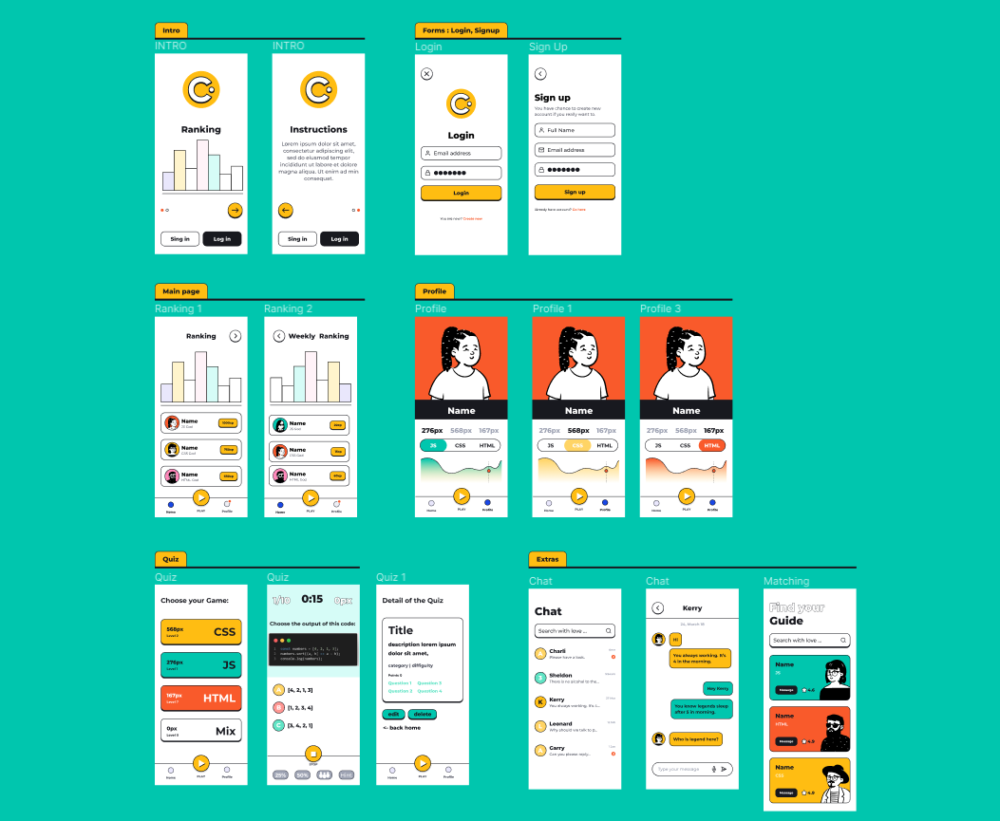

# QuizzesAndMentors

## Description

This is a project developed by Daniel Gonzalez and Elisa Bascón as the project for the second module at Ironhack. The application is a game that allows users to learn through taking quizzes on the topics they want to improve. You can also contact with the users community to receive or provide help according to your degree of knowledge. Play, learn and mentor others!

---

## Wireframes


---

## Instructions

When cloning the project, change the <code>sample.env</code> for an <code>.env</code> with the values you consider:
```js
PORT=3000
MONGO_URL='mongodb://localhost/dbName'
SESSION_SECRET='SecretOfYourOwnChoosing'
NODE_ENV='development'
```
Then, run:
```bash
npm install
```
To start the project run:
```bash
npm run start
```

---

## User stories (MVP)

What can the user do with the app?
- User can sign up and create and account
- User can login
- User can log out
- Admin privileges accounts can create a Quiz by topic and tag it with a difficulty level. A quiz is made up of several questions
- Admin also can create questions and linked it to a Quiz
- Admin accounts can do CRUD operations both for topic and for questions data model
- User when registering gets 100 points in his account
- User can choose a quiz to play by theme as long as they have overcome the previous difficulty levels
- User can earn points and climb positions to the general ranking completing differents quiz levels
- When a user finnish a Quiz will see a screen with evalation of this
- The user can access the profile and consult their personal information
- The app will connect (via profile) lower level users with mentors in the area they need to improve

## User stories (Backlog)

- User can upload a profile picture
- Any user (even without being registered) can consult the score ranking of the best players by quiz topic.
- Any user (even without being registered) can consult the how to play instructions.
- User can access to the profile and check game statistics.
- Each question has a maximum associated response time, if it ends it is considered incorrect.
- For each game, if the user has enough points, he can use jokers that help him get the answer (50% joker, clues, etc.)
- The user will be able to send a message to their mentor through the platform
- Connect to an external API to consume data already created by the community

---

## Models


User:

```js
const userSchema = new Schema(
  {
    username: {
      type: String,
      trim: true,
      required: [true, 'Username is required.'],
      unique: true
    },
    email: {
      type: String,
      required: [true, 'Email is required.'],
      unique: true,
      lowercase: true,
      trim: true
    },
    hashedPassword: {
      type: String,
      required: [true, 'Password is required.']
    }
  },
  {
    timestamps: true
  }
);
```

---

## Routes

| Name  | Method | Endpoint    | Protected | Req.body            | Redirects |
|-------|--------|-------------|------|---------------------|-----------|
| Home  | GET   | /           | No   |                     |           |
| Login | GET    | /auth/login | No |                      |           |
| Login | POST | /auth/login   | No | { email, password }  | /         |
| Signup | GET    | /auth/signup | No |                      |           |
| Signup | POST | /auth/signup   | No | { username, email, password }  | /auth/login  |
| New movie  | GET    | /movies/new | Yes |                      |           |
| New movie | POST | /movies/new   | Yes | { title, cast, genre }  | /movies/:movieId   |

---

## Useful links

- [Github Repo](https://github.com/alebausa/module2-boilerplate)
- [Deployed version]()
- [Presentation slides](https://www.slides.com)


