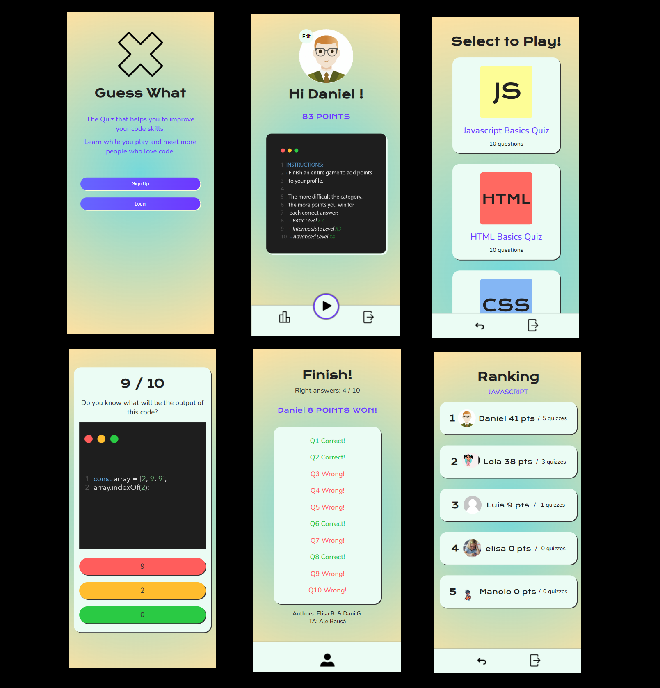

# Guess What

## Description

This is a project developed by Daniel Gonzalez and Elisa Bascón as the project for the second module at Ironhack. The application is a game that allows users to learn about web programming through filling out quizzes. By completing quizzes you will earn reputation points. You can also check the user ranking by topic to know which users have better of worst skills. On this way you could contact them and receive or provide help according to your degree of knowledge. Play, learn and mentor others!

---

## Wireframes


---
## Game Images


## Instructions

When cloning the project, change the <code>sample.env</code> for an <code>.env</code> with the values you consider:
```js
PORT=3000
MONGO_URL='mongodb://localhost/dbName'
SESSION_SECRET='SecretOfYourOwnChoosing'
NODE_ENV='development'
```
Then, run:
```bash
npm install
```
To start the project run:
```bash
npm run start
```

---

## User stories (MVP)

What can the user do with the app?
- User can sign up and create and account
- User can login and log out
- Admin privileges accounts can create a Quiz by topic and tag it with a difficulty level. A quiz is made up of several questions
- Admin also can create questions and linked it to a Quiz
- Admin accounts can do CRUD operations both for topic and for questions data model
- User can choose a quiz to play and will win reputation points by completing quizzes
- User can earn points and climb positions to the general ranking completing differents quiz levels
- When a user finnish a Quiz will see a screen with evaluation of this
- The user can access the profile and consult their personal information
- User can consult the score ranking of the best players by quiz topic.
- User can access to the profile and check game statistics.
- User can upload a profile picture
## User stories (Backlog)

- For each game, if the user has enough points, he can use jokers that help him get the answer (50% joker, clues, etc.)
- The user will be able to send a message to their mentor through the platform
- Big size screens responsive design support
---

## Models

User:

```js
const userSchema = new Schema(
  {
    username: {
      type: String,
      trim: true,
      required: [true, "Username is required."],
      unique: true,
    },
    email: {
      type: String,
      required: [true, "Email is required."],
      unique: true,
      lowercase: true,
      trim: true,
    },
    hashedPassword: {
      type: String,
      required: [true, "Password is required."],
    },
    user_img: {
      type: String,
      default: "/images/profile/default.jpg",
    },
    points: {
      type: Number,
      required: [true, "Points are required"],
      default: 0,
    },
    role: {
      type: String,
      enum: ["player", "admin"],
      default: "player",
    },
  },
  {
    timestamps: true,
  }
);
```
Quiz:

```js
const quizSchema = new Schema({
  title: {
    type: String,
    required: [true, "Title is required"],
    unique: true,
  },
  description: {
    type: String,
    required: [true, "Description is required"],
  },
  category: {
    type: String,
    enum: ["JAVASCRIPT", "CSS", "HTML"],
    required: [true, "Category is required"],
  },
  difficulty: {
    type: String,
    enum: ["BASICS", "INTERMEDIATE", "ADVANCED"],
    required: [true, "Difficulty is required"],
  },
  points_required: {
    type: Number,
    required: [true, "Points are required"],
  },
  num_questions: {
    type: Number,
    required: [true, "Number of questions are required"],
  },
  quiz_img: {
    type: String,
  },
  isVisible: {
    type: Boolean,
  },
  question: {
    type: [Schema.Types.ObjectId],
    ref: "Question",
    required: [true, "Questions are required"],
  },
});

```
Question:

```js
const questionSchema = new Schema({
  question: {
    type: String,
    required: [true, "Question is required"],
  },
  correct_answer: {
    type: String,
    required: [true, "Answer is required"],
  },
  incorrect_answers: {
    type: [String],
    required: [true, "Incorrect Answer is required"],
  },
  category: {
    type: String,
    enum: ["JAVASCRIPT", "CSS", "HTML"],
    required: [true, "Category is required"],
  },
  difficulty: {
    type: String,
    enum: ["BASICS", "INTERMEDIATE", "ADVANCED"],
    required: [true, "Difficulty is required"],
  },
  question_img: {
    type: String,
    default: "/images/questions/default.jpg",
  },
  isVisible: {
    type: Boolean,
  },
});

```
Game:

```js
const gameSchema = new Schema(
  {
    user: {
      type: Schema.Types.ObjectId,
      ref: "User",
    },
    quiz: {
      type: Schema.Types.ObjectId,
      ref: "Quiz",
    },
    status: {
      type: String,
      enum: ["NOT INIT", "IN PROGRESS", "DONE"],
      default: "NOT INIT",
    },
    current_question: {
      type: Number,
      default: -1,
    },
    answers: {
      type: [Boolean],
    },
    total_right_answers: {
      type: Number,
      default: -1,
    },
    total_wrong_answers: {
      type: Number,
      default: -1,
    },
    total_points: {
      type: Number,
      default: -1,
    },
  },
  {
    timestamps: true,
  }
);

```

## Routes

| Name  | Method | Endpoint    | Protected | Req.body            | Redirects |
|-------|--------|-------------|------|---------------------|-----------|
| Home  | GET   | /           | No   |                     |           |
| Login | GET    | /auth/login | No |                      |           |
| Login | POST | /auth/login   | No | { email, password }  | /profile  |
| Logout | POST    | /auth/logout | Yes |                    | /          |
| Signup | GET    | /auth/signup | No |                      |           |
| Signup | POST | /auth/signup   | No | { username, email, password }  | /auth/login  |
| Game Select | GET    | /game/select | Yes |                    |           |
| Game | GET    | /game/:quizId | Yes |                      |           |
| Game | POST    | /game/:questionId/:gameId/check | Yes | { answer } | /game/${quizid} |
| Profile  | GET   | /profile         | Yes   |                     |           |
| Profile  | GET   | /profile/:userId/edit    | Yes   |                     |           |
| Profile  | POST   | /profile/:userId/edit    | Yes   | {existingImage} | /profile |
| Questions | GET    | /questions | Yes |                      |           |
| Questions | GET    | /questions/create | Yes |                      |           |
| Questions | POST    | /questions/create | Yes |  { question, correct_answer, category, difficulty }  |  /questions  |
| Questions | GET    | /questions/:questionId | Yes |                     |           |     
| Questions | POST    | /questions/:questionId/delete | Yes |                     |   /questions        | 
| Questions | GET    | /questions/:questionId/edit | Yes |                     |   /questions        | 
| Questions | POST    | /questions/:questionId/edit | Yes |  { question, correct_answer, category, difficulty }  |  /questions/${questionId}      |
| Quizzes | GET    | /quizzes | Yes |                      |           |
| Quizzes | GET    | /quizzes/create | Yes |                      |           |
| Quizzes | POST    | /quizzes/create | Yes |  {title, description, category, num_questions}                   |  /quizzes/create   | 
| Quizzes | GET    | /quizzes/:quizId | Yes |                     |           |     
| Quizzes | POST    | /quizzes/:quizId/delete | Yes |                     |   /quizzes        | 
| Quizzes | GET    | /quizzes/:quizId/edit | Yes |                     |   /quizzes        | 
| Quizzes | POST    | /quizzes/:quizId/edit | Yes |  {title, description, category, num_questions}  |  /quizzes/${quizId}      |
| Ranking  | GET   | /           | Yes   |                     |           |
| Ranking  | GET   | /:category           | Yes   |                     |           |


---

## Useful links

- [Github Repo](https://github.com/danignz/app2)
- [Deployed version](https://guesswhat-ih.herokuapp.com/)
- [Presentation slides](https://slides.com/elisab-1/minimal)
